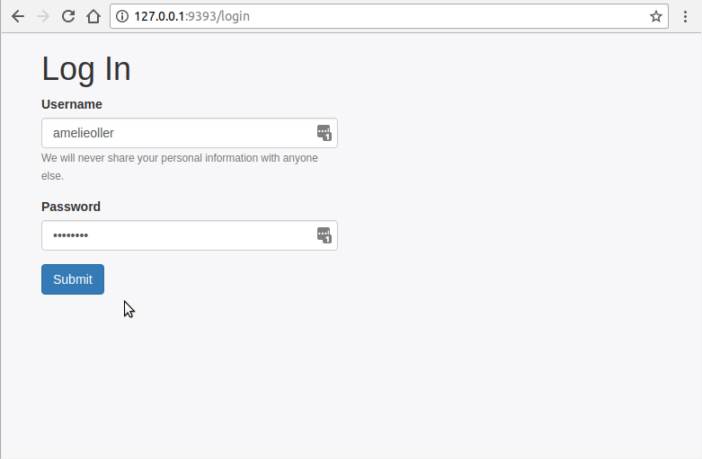

# Favorite Places
Welcome to 'Favorite Places'! Favorite places is a small ruby-sinatra web application that lets you sign up and create your favorite places(place name, city, country). You can view, edit and delete your own entries but only view other people's entries.

## Walkthrough

## Installation
1. Clone the repo
2. run `bundle install`
2. run `rake db:migrate`
3. run `shotgun` and open the provided link in your browser

## Usage
* Sign up on the welcome page
* From the navigation you may create a new place, view all places, only your places or logout
* You can search each place via Google by clicking on the button for each place on the index page
* You can view, edit or delete each of your places in the "My Places" view
* When you create a new place make sure all fields are filled out

## Contributing
Bug reports and pull requests are welcome on GitHub at https://github.com/amelieoller/favorite-places. This project is intended to be a safe, welcoming space for collaboration, and contributors are expected to adhere to the [Contributor Covenant](http://contributor-covenant.org) code of conduct.

## License
This app is available as open source under the terms of the [MIT License](http://opensource.org/licenses/MIT).